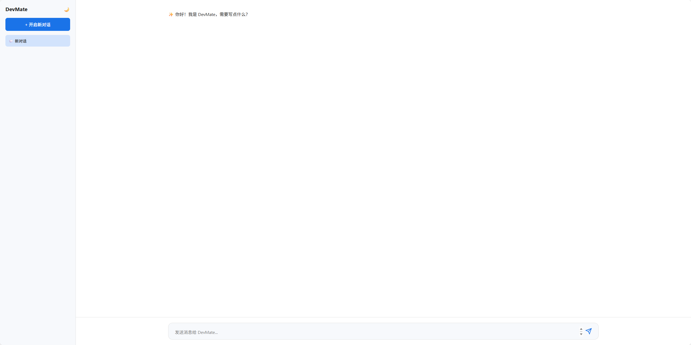

# 这是一个DevMate项目

## 一、准备
 1.打开config.toml填入自己的url和apikey

 2.rag的embedding模型我使用了本地的bge-small-zh-v1.5模型，运行时从modelscope自动下载

## 二、手动启动
 1.cd DevMate文件夹，在终端中输入 `uv sync`根据`pyproject.toml`创建虚拟环境

 2.运行`start.bat`文件，运行时会占用8000和8080两个端口，请确保这两个端口没有被占用

 3.稍作等待，用默认浏览器打开src/chat.html文件

## 三、docker启动
 1.在DevMate目录下的终端中运行`docker compose up`命令

 2.稍作等待，用默认浏览器打开src/chat.html文件